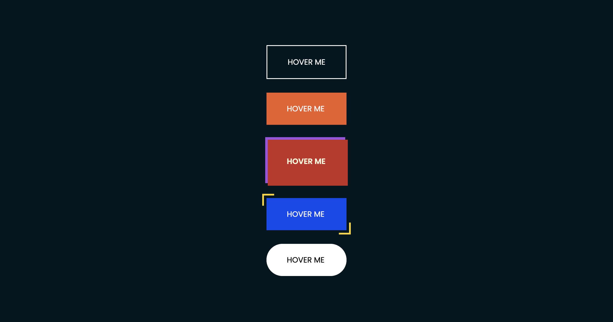

# Button Hover Effects

## Project Overview
This project demonstrates five unique button hover effects using HTML and CSS. Each button has a different hover animation created with the help of pseudo-elements (::before, ::after) and CSS transitions. The buttons offer a wide variety of interactive visual effects, including sliding text, 3D flips, layered shadows, and expanding backgrounds.

## Features
* Button 1: A sliding "DOWNLOAD" text effect.
* Button 2: A 3D flip animation with two background colors.
* Button 3: A multi-layered shadow effect that rotates in 3D.
* Button 4: Expanding borders that animate on hover.
* Button 5: A smooth background scaling effect with a fading animation.

## Screenshots

## Demo
You can view the live demo of this project by clicking the link below:

[Click here to view the demo](https://skylaryhu.github.io/buttons/)